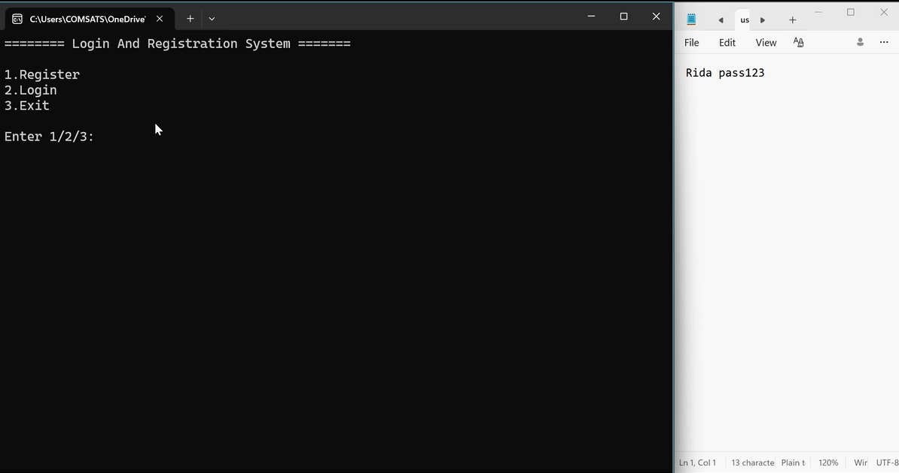
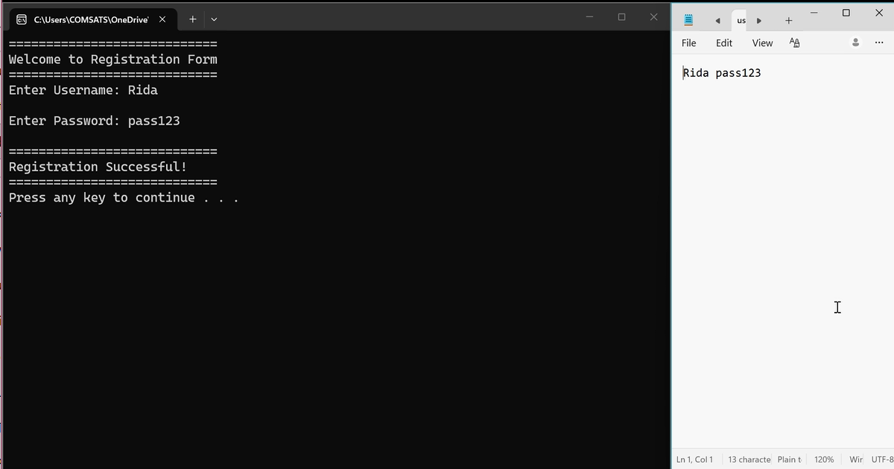
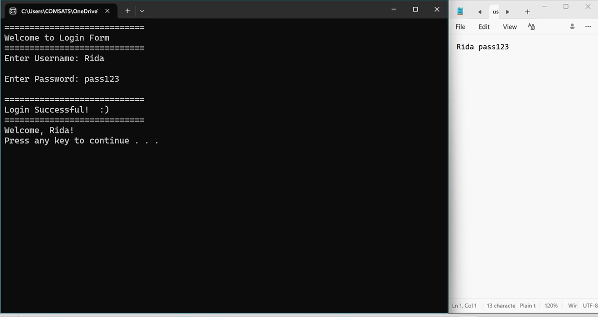
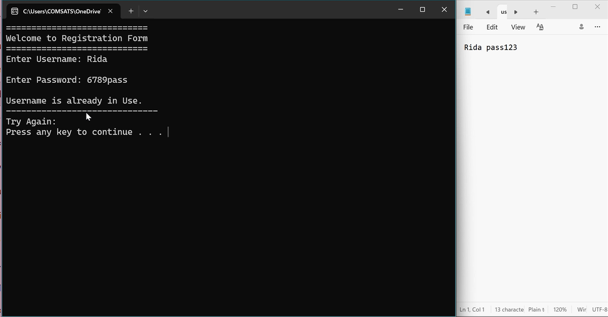
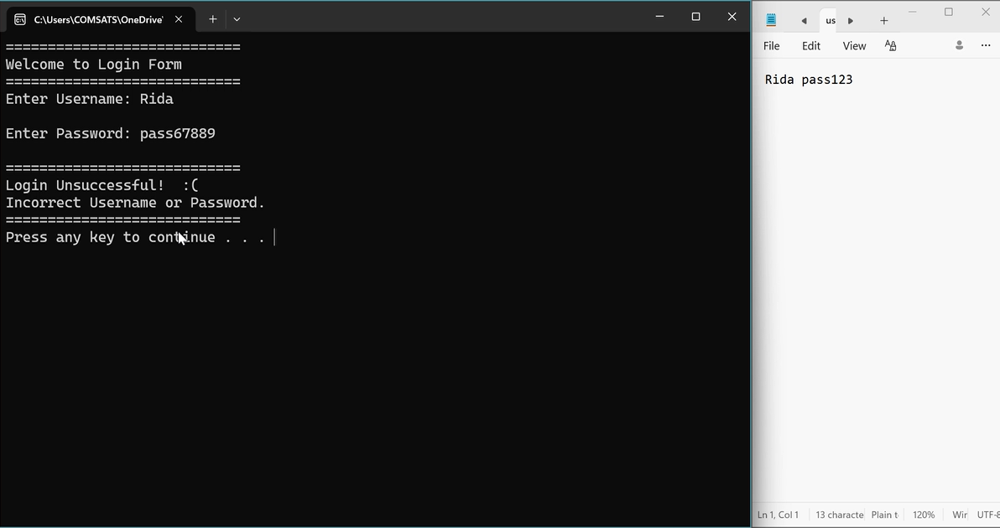
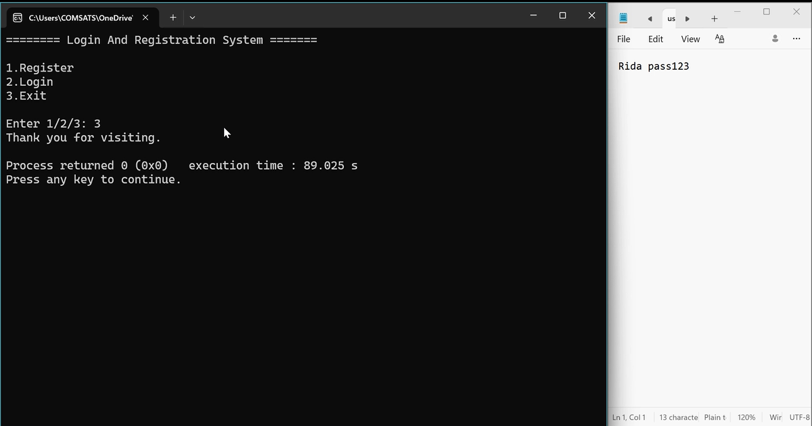

# 🔐 Login & Registration System (C++)

A console-based Login and Registration System developed in **C++** to practice file handling, user authentication, and fundamental programming concepts. This project allows users to create an account and log in using stored credentials.

---

## 📌 Overview

This project was created to strengthen my understanding of C++ programming by implementing a simple authentication system. User information is stored using file handling, allowing registered users to log in with their saved credentials.

---

## ✨ Features

* User Registration
* User Login
* Credential Validation
* File-Based Data Storage
* Console-Based Interface
* Simple Menu-Driven Navigation

---

## 🛠️ Technologies Used

* C++
* File Handling
* Object-Oriented Programming (where applicable)

---

## ▶️ How to Run

### Requirements

- Code::Blocks IDE (with the built-in GCC/G++ compiler)
- Windows Operating System

### Steps

1. Download or clone this repository.
2. Open the project in **Code::Blocks**.
3. Make sure the project is using the **GCC/G++ compiler** included with Code::Blocks.
4. Build and run the project by pressing **F9** or selecting **Build → Run**.
5. Follow the on-screen instructions to register a new account or log in.

> **Note:** This project was developed and tested using **Code::Blocks with the GCC/G++ compiler**. It may require modifications to compile correctly in other IDEs or compilers.

---

## 📂 Project Structure

```text
Login_And_Registration_System/
│
├── Source.cpp
├── UserData.txt
└── README.md
```

> Replace the filenames above if your project uses different names.

---

## 📚 What I Learned

Through this project, I improved my understanding of:

* File handling in C++
* Reading and writing text files
* User input validation
* Program flow and menu-driven applications
* Basic authentication logic

---

## 🚀 Future Improvements

* Password masking during input
* Password hashing for better security
* Forgot Password functionality
* Account deletion
* Better error handling
* Graphical User Interface (GUI)

---

## 👩‍💻 Author

**Rida Fatima Shahbaz**

BS Computer Science Student

COMSATS University Islamabad, Lahore Campus

## 📸 Screenshots

### 🏠 Main Menu

<p align="center">
  
</p>

---

### 🔑 Registration & Login

<p align="center">
  
  
</p>

---

### ✅ Results

<p align="center">
  
  
</p>

---

### 🚪 Exit Screen

<p align="center">
  
</p>
